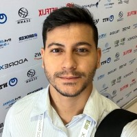

{:.circle.border.shadow}

Sou um amante te tecnologia, me formei em Engenharia de Telecomunicações pelo IFCE. Tenho experiência em Operações de Segurança (SOC), com foco em SIEM e Threat Hunting.

Atualmente, estou aprofundando meus conhecimentos em DFIR e Análise de Malware.
